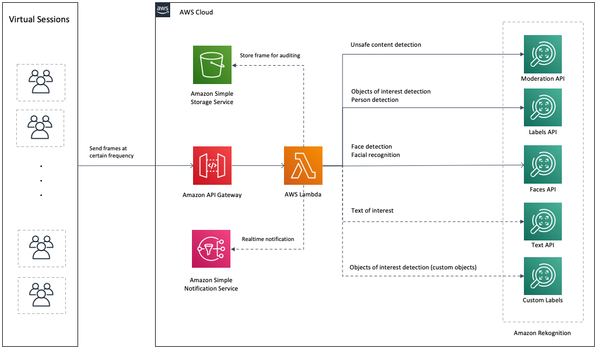

## Virtual Proctor using Amazon Rekognition

Proctoring is the act of supervising an exam or course online.

Using web-based applications, virtual proctoring platforms allow test takers to be virtually monitored by a human via the webcam on their computer.
To increase the scale of the test taking and improve a human proctor’s ability to monitor students, virtual proctoring services are now implementing AI/ML to support the human proctor.

Virtual Proctor is a solution that leverages Amazon Rekognition to show a scalable way to conduct online testing.

It shows how you can implement rules such as:

- Detecting objects of interest (such as mobile phone)
- Detecting the number of people present
- Recognizing the person who is taking a test
- Detecting unsafe content (such as explicit adult content or violent content)

You can also use [Amazon Rekognition Custom Labels](https://aws.amazon.com/rekognition/custom-labels-features/) to detect other custom objects of interest.

### Index

- [Architecture](#architecture)
- [Usage](#usage)
  - [Prerequisites](#prerequisites)
  - [Deployment](#deployment)
  - [Accessing the application](#accessing-the-application)
- [Remove the application](#remove-the-application)
- [Making changes to the code and customization](#making-changes-to-the-code-and-customization)
- [Samples](#samples)
- [Contributing](#contributing)

### Architecture

  

### Usage

#### Prerequisites

To deploy the sample application, you will require an AWS account. If you don’t already have an AWS account, create one at <https://aws.amazon.com> by following the on-screen instructions. Your access to the AWS account must have IAM permissions to launch AWS CloudFormation templates that create IAM roles.

To use the sample application you will require a [modern browser](https://caniuse.com/#feat=stream) and a webcam.

#### Deployment

The demo application is deployed as an [AWS CloudFormation](https://aws.amazon.com/cloudformation) template.

> **Note**  
> You are responsible for the cost of the AWS services used while running this sample deployment. There is no additional cost for using this sample. For full details, see the following pricing pages for each AWS service you will be using in this sample. Prices are subject to change.
>
> - [Amazon Rekognition Pricing](https://aws.amazon.com/rekognition/pricing/)
> - [Amazon S3 Pricing](https://aws.amazon.com/s3/pricing/)
> - [Amazon Cognito Pricing](https://aws.amazon.com/cognito/pricing/)
> - [Amazon CloudFront Pricing](https://aws.amazon.com/cloudfront/pricing/)

1. Deploy the latest CloudFormation template by following the link below for your preferred AWS region:

| Region                                        | Launch Template                                                                                                                                                                                                                                                                                                                              |
| --------------------------------------------- | -------------------------------------------------------------------------------------------------------------------------------------------------------------------------------------------------------------------------------------------------------------------------------------------------------------------------------------------- |
| **US East (N. Virginia)** (us-east-1)         |                 |
| **US East (Ohio)** (us-east-2)                |                 |
| **US West (Oregon)** (us-west-2)              |                 |
| **EU (Ireland)** (eu-west-1)                  |                 |
| **Asia Pacific (Sydney)** (ap-southeast-2)    |  |
| **Asia Pacific (Singapore)** (ap-southeast-1) |  |
| **Asia Pacific (Mumbai)** (ap-south-1)        |              |

2. If prompted, login using your AWS account credentials.
3. You should see a screen titled "_Create Stack_" at the "_Specify template_" step. The fields specifying the CloudFormation template are pre-populated. Click the _Next_ button at the bottom of the page.
4. On the "_Specify stack details_" screen you may customize the following parameters of the CloudFormation stack:

   - **Stack Name:** (Default: VirtualProctor) This is the name that is used to refer to this stack in CloudFormation once deployed.
   - **AdminEmail:** The email address you wish to setup as the initial user of this Amazon Rekognition Virtual Proctor deployment.
   - **MinConfidence:** (Default: 85) Specifies the minimum confidence level for the labels to return.
   - **ObjectsOfInterestLabels** (Default "Mobile Phone,Cell Phone"): Comma-delimited list of labels used to detect Objects of interest.
   - **CreateCloudFrontDistribution** (Default: true) Creates a CloudFront distribution for accessing the web interface of the solution.
   - **ResourcePrefix:** (Default: VirtualProctor) Resource prefix to apply to resource names when creating statically named resources.

   When completed, click _Next_

5. [Configure stack options](https://docs.aws.amazon.com/AWSCloudFormation/latest/UserGuide/cfn-console-add-tags.html) if desired, then click _Next_.
6. On the review you screen, you must check the boxes for:

   - "_I acknowledge that AWS CloudFormation might create IAM resources_"
   - "_I acknowledge that AWS CloudFormation might require the following capability: CAPABILITY_AUTO_EXPAND_"

   These are required to allow CloudFormation to create a Role to allow access to resources needed by the stack and name the resources in a dynamic way.

7. Click _Create Change Set_
8. On the _Change Set_ screen, click _Execute_ to launch your stack.
   - You may need to wait for the _Execution status_ of the change set to become "_AVAILABLE_" before the "_Execute_" button becomes available.
9. Wait for the CloudFormation stack to launch. Completion is indicated when the "Stack status" is "_CREATE_COMPLETE_".
   - You can monitor the stack creation progress in the "Events" tab.
10. Note the _url_ displayed in the _Outputs_ tab for the stack. This is used to access the application.

#### Accessing the Application

The application is accessed using a web browser. The address is the _url_ output from the CloudFormation stack created during the Deployment steps.

When accessing the application for the first time, you need to use the Admin e-mail provided during Stack Creation as the username. A temporary password will be sent to the same e-mail address. After authentication, it will be necessary to create a new password and click "Change".

To manage users, you can use the [Cognito Users Pool console](https://console.aws.amazon.com/cognito/users).

### Remove the application

To remove the application open the AWS CloudFormation Console, click the Virtual Proctor project, right-click and select "_Delete Stack_". Your stack will take some time to be deleted. You can track its progress in the "Events" tab. When it is done, the status will change from "_DELETE_IN_PROGRESS_" to "_DELETE_COMPLETE_". It will then disappear from the list.

### Making changes to the code and customization

The [contributing guidelines](CONTRIBUTING.md) contains some instructions about how to run the front-end locally and make changes to the back-end stack.

### Samples

[Python Samples](./python-samples) contains python snippets for virtual proctoring usecases

## Contributing

Contributions are more than welcome. Please read the [code of conduct](CODE_OF_CONDUCT.md) and the [contributing guidelines](CONTRIBUTING.md).

## License Summary

This library is licensed under the MIT-0 License. See the LICENSE file.
